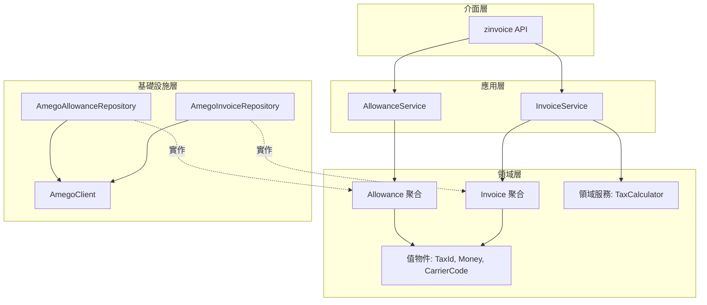

# zinvoice - 台灣電子發票加值中心整合套件

## Context 背景

建立一個可透過 npm 安裝的公開套件，用於串接台灣電子發票加值中心（如光貿等系統商）。
採用**策略模式**設計，讓不同系統商可以用統一介面操作。

- **npm 套件名稱**：`zinvoice`（已確認可用）
- **授權條款**：Apache 2.0
- **版權持有者**：Zentring LTD.
- **首發 Provider**：光貿（Amego）

## 光貿 API 規格摘要

| 項目 | 內容 |
|------|------|
| API 網址 | `https://invoice-api.amego.tw` |
| 認證方式 | MD5 簽名 = `md5(data + time + AppKey)` |
| Content-Type | `application/x-www-form-urlencoded` |
| MIG 版本 | 4.0（2025/1/1 起） |

### 主要端點（MIG 4.0）

| 功能 | 端點 |
|------|------|
| 開立發票（自動配號） | `POST /json/f0401` |
| 作廢發票 | `POST /json/f0501` |
| 發票狀態 | `POST /json/invoice_status` |
| 發票查詢 | `POST /json/invoice_query` |
| 發票列表 | `POST /json/invoice_list` |
| 開立折讓 | `POST /json/g0401` |
| 作廢折讓 | `POST /json/g0501` |
| 手機條碼驗證 | `POST /json/barcode` |
| 公司名稱查詢 | `POST /json/ban_query` |

## High-Level Design 架構設計（DDD）



### DDD 核心概念

| 概念 | 說明 | 範例 |
|------|------|------|
| **聚合根** | 業務邊界的入口 | Invoice, Allowance |
| **實體** | 有唯一識別的物件 | InvoiceItem |
| **值物件** | 靠值定義、不可變 | TaxId, Money, CarrierCode |
| **儲存庫** | 持久化抽象 | InvoiceRepository |
| **領域服務** | 跨實體的業務邏輯 | TaxCalculator |
| **應用服務** | 協調領域物件 | InvoiceService |

## 專案結構

```
zinvoice/
├── src/
│   ├── index.ts                              # 公開 API
│   │
│   ├── domain/                               # 領域層（核心業務邏輯）
│   │   ├── invoice/                          # 發票聚合
│   │   │   ├── Invoice.ts                    # 發票實體（聚合根）
│   │   │   ├── InvoiceItem.ts                # 發票明細
│   │   │   ├── InvoiceNumber.ts              # 發票號碼（值物件）
│   │   │   ├── InvoiceRepository.ts          # 儲存庫介面
│   │   │   └── index.ts
│   │   ├── allowance/                        # 折讓聚合
│   │   │   ├── Allowance.ts                  # 折讓實體（聚合根）
│   │   │   ├── AllowanceItem.ts              # 折讓明細
│   │   │   ├── AllowanceRepository.ts        # 儲存庫介面
│   │   │   └── index.ts
│   │   ├── shared/                           # 共用值物件
│   │   │   ├── TaxId.ts                      # 統一編號
│   │   │   ├── Money.ts                      # 金額
│   │   │   ├── CarrierCode.ts                # 載具條碼
│   │   │   ├── TaxType.ts                    # 課稅別
│   │   │   └── index.ts
│   │   └── services/                         # 領域服務
│   │       ├── TaxCalculator.ts              # 稅額計算
│   │       └── index.ts
│   │
│   ├── application/                          # 應用層（用例協調）
│   │   ├── InvoiceService.ts                 # 發票應用服務
│   │   ├── AllowanceService.ts               # 折讓應用服務
│   │   └── index.ts
│   │
│   ├── infrastructure/                       # 基礎設施層
│   │   └── amego/                            # 光貿實作
│   │       ├── AmegoClient.ts                # HTTP 客戶端 + 簽名
│   │       ├── AmegoInvoiceRepository.ts     # 發票儲存庫實作
│   │       ├── AmegoAllowanceRepository.ts   # 折讓儲存庫實作
│   │       ├── mappers/                      # DTO <-> Domain 轉換
│   │       │   ├── InvoiceMapper.ts
│   │       │   └── AllowanceMapper.ts
│   │       └── index.ts
│   │
│   └── errors/                               # 自定義錯誤
│       └── index.ts
│
├── tests/                                    # 測試
│   ├── domain/
│   ├── application/
│   └── infrastructure/
├── LICENSE                                   # Apache 2.0
├── tsconfig.json
├── tsup.config.ts                            # 建置設定（ESM + CJS）
├── vitest.config.ts                          # 測試設定
├── package.json
├── .gitignore
└── .npmignore
```

## Step-by-Step Implementation 實作步驟

### Phase 1: 專案基礎建設
1. 更新 `package.json`（完整 npm 發布設定）
2. 建立 `LICENSE`（Apache 2.0）
3. 建立 `tsconfig.json`
4. 建立 `tsup.config.ts`（雙模式輸出）
5. 建立 `vitest.config.ts`
6. 更新 `.gitignore` 和建立 `.npmignore`

### Phase 2: 領域層 - 共用值物件
1. 建立 `TaxId` 值物件（統一編號 + 檢查碼驗證）
2. 建立 `Money` 值物件（金額處理）
3. 建立 `CarrierCode` 值物件（載具條碼驗證）
4. 建立 `TaxType` 值物件（課稅別列舉）
5. 建立自定義錯誤類別

### Phase 3: 領域層 - 發票聚合
1. 建立 `InvoiceNumber` 值物件
2. 建立 `InvoiceItem` 實體
3. 建立 `Invoice` 聚合根
4. 定義 `InvoiceRepository` 介面

### Phase 4: 領域層 - 折讓聚合
1. 建立 `AllowanceItem` 實體
2. 建立 `Allowance` 聚合根
3. 定義 `AllowanceRepository` 介面

### Phase 5: 領域服務
1. 建立 `TaxCalculator` 領域服務（含稅/未稅轉換、稅額計算）

### Phase 6: 基礎設施層 - 光貿實作
1. 建立 `AmegoClient`（HTTP + MD5 簽名）
2. 建立 `InvoiceMapper`（DTO <-> Domain）
3. 建立 `AmegoInvoiceRepository`
4. 建立 `AllowanceMapper`
5. 建立 `AmegoAllowanceRepository`

### Phase 7: 應用層
1. 建立 `InvoiceService`
2. 建立 `AllowanceService`

### Phase 8: 公開 API 與測試
1. 建立 `src/index.ts` 匯出
2. 撰寫單元測試
3. 驗證建置輸出

## Verification Strategy 驗證策略

1. **建置驗證** - `npm run build` 產出 ESM + CJS
2. **型別驗證** - `tsc --noEmit` 確保型別正確
3. **單元測試** - `npm test` 執行 vitest
4. **Dry Run 發布** - `npm pack --dry-run` 檢查發布內容

## 技術選型

| 項目 | 選擇 | 理由 |
|------|------|------|
| 建置工具 | tsup | 簡單、支援雙模式、零配置 |
| 測試框架 | vitest | 快速、TypeScript 原生支援 |
| HTTP Client | 內建 fetch | Node 18+ 原生支援，無需額外依賴 |

---

**請確認此計畫是否符合需求，確認後即可開始實作！**
